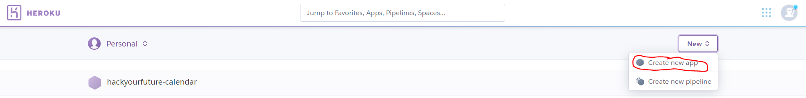
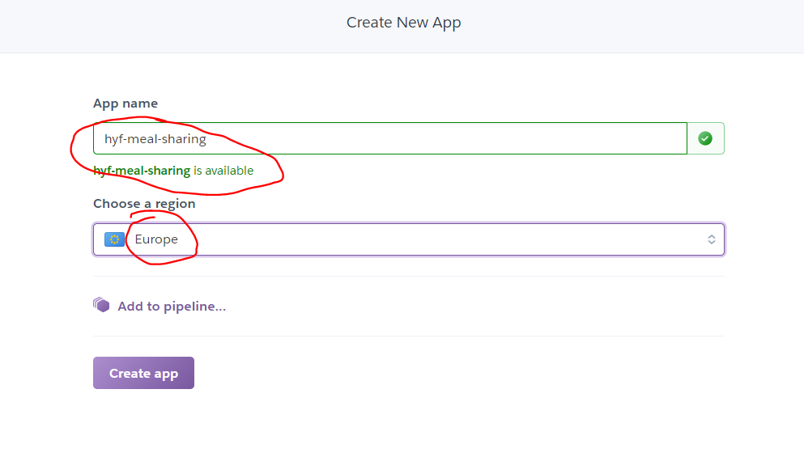
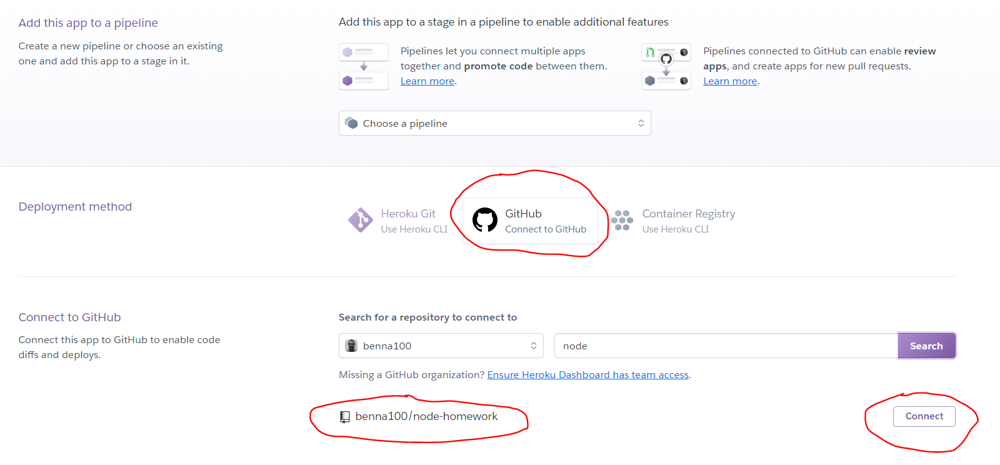
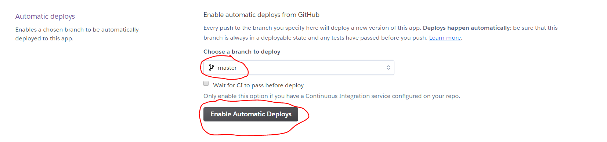
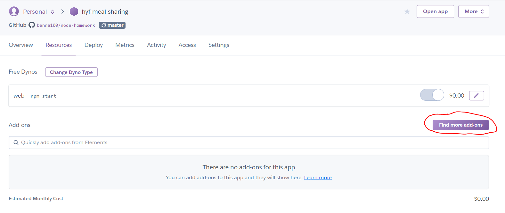

# Deploying to Heroku

Create a heroku user by going to heroku.com

## First create a new app

- Now create a new app

- Give the app a good name and choose Europe as the region

## Setup automatic deployment

Lets set our new app so that everytime we push code to master, that code is deployed to our website.

- Choose Github for deployment method

- Choose the `master` branch on your `meal-sharing` repo and click `Enable Automatic Deploys`

## Adding a database

The database we have used so far is the local one running in Mysql Workbench. Now we will add a database in the cloud.

- Under `Resources` click `Find more add-ons`

- Add clear `ClearDB MySQL`. Congratulations we now have a database in the cloud. Now we just need to connect it to our app.
- Like we have out `.env` file locally that referes to the environment variables in herkou we have to add them manually:

### Adding environment variables

- Go to `Settings`. Click `Reveal Config Vars`. It will have the format of: `mysql://{user}:{pass}@{host}/{database}`
- Exactly like the `.env` file add the same environment variables. The `DB_PORT` should be 3306.

Now the database is connected to the app 🎉

BUT the database has no tables! Connect to the ClearDB database using Mysql Workbench and create the tables in workbench just like you have with the local database.

We should now have connected the database (with the newly inserted tables) to our application. Try and go to the app's webpage and see if it works.

If there is an error, use this command: `heroku logs --tail --app app-name` - substitute `app-name` with the actual app name. TO install it go [here](https://devcenter.heroku.com/articles/heroku-cli)

## Add link to the website

Remember to add the link to the deployed website in the readme.md file (of the `meal-sharing` repo) where it says: `Link to deployed website: `
