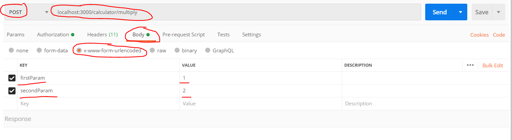

# Homework

## Get git ready to work on homework

Using the `hyf-homework` repo. In the terminal run `git status`

If there are changes that have not been committed, figure out what to do with those changes

- Should they be committed to another branch?
- Should they be committed to `master`?
- Should they be discarded?

When you have figured out what to do with the changes and fixed those. Write `git status` again. If it says `nothing to commit, working tree clean`. Then you are ready to create the branch for this weeks homework.

### Creating the branch

Using the `hyf-homework` repo write this command

`git checkout master` - You are now on the `master` branch

`git checkout -b nodejs/week3`

This will create and checkout the branch so you are ready make commits to it

[This video](https://www.youtube.com/watch?v=XYlgh9hSWtw) can help. On slack use the #git-support channel to ask questions about git

## So why this homework?

Working with APIs is such a core way for the client to communicate with the server. Creating an API abstracts away lots of complexity and makes it easy to create users, get users, changing users etc.

> Please help us improve and share your feedback! If you find better tutorials or links, please share them by opening a Pull Request.

## Warmup

Copy the warmup project from [here](../homework/warmup) into your `hyf-homework/nodejs/week3` folder

Remember to run `npm install` then `npm run dev` to start the server

### Calculator

Let's again create a calculator. This time the calculator will support 4 features:

- Addition
- Subtraction
- Multiplication
- Division

All the numbers that should be inputted should be gotten from the query parameters: `calculator?firstParam=1&secondParam=2...`

This exercise is made to show that you can receive data from the request in multiple ways!

#### Getting data through query parameters using `GET`

- Going to `/calculator/multiply?firstParam=1&secondParam=2` should respond with 2.
- Going to `/calculator/multiply?firstParam=1&secondParam=2&secondParam=4` should respond with 8.
- Going to `/calculator/add?firstParam=1&secondParam=2&secondParam=4` should respond with 7.

There can be an infinite number of query parameters!

#### Getting data through the request body using `POST`

You can only do the post request through a form unsing html or using postman. For this homework, use postman with the following setup:

- Going to `/calculator/multiply` with the following key values: firstParam=1, secondParam=2. Should respond with 2.
- Going to `/calculator/division` with the following key values: firstParam=1, secondParam=2. Should respond with 0.5.

## Lets build a real functioning site :)

To visualize what we will be building, take a look at: https://www.eatwith.com/

You will be building your own version of this site.

### Getting started with the repo

This meal sharing website is a perfect showcase for future employeers, so really show off your skills 💪. Because of this the project will not live in the `hyf-homework` but as a seperate repo on your profile.

To get started we have created a template, so that you can focus on developing what matters 💪💻

Go to https://github.com/HackYourFuture-CPH/meal-sharing-template/generate and give the new repo the name `meal-sharing`. Click `Create repository from template`. You should now have a meal-sharing repo here: `https://github.com/YOUR_GITHUB_USER_NAME/meal-sharing` like `https://github.com/benna100/meal-sharing`. Clone that repo down locally.

#### Where to create your code

Now for us mentors to easily give feedback on your code create all functionality in a PR just like we do normally with homework, so:

`git checkout -b nodejs/week3` <- in the meal-sharing repo you have cloned down!

Now you can make your code in the `nodejs/week3` branch and when you are done create a PR with the `nodejs/week3` branch.

If this is confusing please reach out!!

### Its coding time

Please read the [readme file](https://github.com/HackYourFuture-CPH/meal-sharing-template/blob/master/readme.md) first to setup the project.

Create the following rest endpoints:

#### Meal

| Url              | Verb   | Functionality            | Example           |
| ---------------- | ------ | ------------------------ | ----------------- |
| `api/meals/`     | GET    | Returns all meals        | `GET api/meals/`  |
| `api/meals/`     | POST   | Adds a new meal          | `POST api/meals/` |
| `api/meals/{id}` | GET    | Returns meal by `id`     | `GET api/meals/2` |
| `api/meals/{id}` | PUT    | Updates the meal by `id` | `PUT api/meals/2` |
| `api/meals/{id}` | DELETE | Deletes the meal by `id` | `DELETE meals/2`  |

##### `GET api/meals/` query parameters

| Parameter               | Description                                                                                                    | Data type | Example                                                         |
| ----------------------- | -------------------------------------------------------------------------------------------------------------- | --------- | --------------------------------------------------------------- |
| `maxPrice`              | Get meals that has a price smaller than `maxPrice`                                                             | Number    | `api/meals?maxPrice=90`                                         |
| `availableReservations` | Get meals that still has available reservations                                                                | Boolean   | `api/meals?availableReservations=true`                          |
| `title`                 | Get meals that partially match a title. `Rød grød med` will match the meal with the title `Rød grød med fløde` | String    | `api/meals?title=Indian%20platter` (`%20` is a space character) |
| `createdAfter`          | Get meals that has been created after the date                                                                 | Date      | `api/meals?createdAfter=2019-04-05`                             |
| `limit`                 | Only specific number of meals                                                                                  | Number    | `api/meals?limit=4`                                             |

#### Reservation

| Url                     | Verb   | Functionality                   | Example                     |
| ----------------------- | ------ | ------------------------------- | --------------------------- |
| `api/reservations/`     | GET    | Returns all reservations        | `GET api/reservations/`     |
| `api/reservations/`     | POST   | Adds a new reservation          | `POST api/reservations/`    |
| `api/reservations/{id}` | GET    | Returns reservation by `id`     | `GET api/reservations/2`    |
| `api/reservations/{id}` | PUT    | Updates the reservation by `id` | `PUT api/reservations/2`    |
| `api/reservations/{id}` | DELETE | Deletes the reservation by `id` | `DELETE api/reservations/2` |

#### Review _optional_

| Url                | Verb   | Functionality              | Example                |
| ------------------ | ------ | -------------------------- | ---------------------- |
| `api/reviews/`     | GET    | Returns all reviews        | `GET api/reviews/`     |
| `api/reviews/`     | POST   | Adds a new review          | `POST api/reviews/`    |
| `api/reviews/{id}` | GET    | Returns review by `id`     | `GET api/reviews/2`    |
| `api/reviews/{id}` | PUT    | Updates the review by `id` | `PUT api/reviews/2`    |
| `api/reviews/{id}` | DELETE | Deletes the review by `id` | `DELETE api/reviews/2` |

#### Using the api

Using Postman use the api to create some `meals`, `reservations` and possibly `reviews`. Use `delete`, `put`, `get` and `post`.

Use the query parameters in the `GET api/meals/`.

## Hand in Homework:

Watch [this video](https://www.youtube.com/watch?v=XYlgh9hSWtw) for a more detailed go-through of how to hand in homework!

- Use the branch called `nodejs/week3`
- Add all your changes to this branch in the `nodejs/week3` folder.
- Go through the [Homework checklist](#homework-checklist)
- Create a pull request using the `nodejs/week3` branch
- Wait for mentor feedback
- Implement feedback, `add`, `commit` and `push` the changes
- Now you can merge the changes into `master`
- When merged you can **share the github link** to your classes slack channel if you are **proud of what you did** 💪
- Now celebrate 🎉🎉🎉

## Homework checklist

Go over your homework one last time:

- [ ] Does every file run without errors and with the correct results?
- [ ] Have you used `const` and `let` and avoided `var`?
- [ ] Do the variable, function and argument names you created follow the [Naming Conventions](https://github.com/HackYourFuture/fundamentals/blob/master/fundamentals/naming_conventions.md)?
- [ ] Is your code well-formatted (see [Code Formatting](https://github.com/HackYourFuture/fundamentals/blob/master/fundamentals/naming_conventions.md))?

## Feedback giving time!

Find a student to give feedback using this site: https://hyf-peer-review.herokuapp.com/. The feedback should be given after the homework has been handed in, preferably two days after.

Give the review on the PR exactly how the mentors do it! To find the link for the PR ask the person you are reviewing :) You can see how to give feedback on a PR using github [here](https://docs.github.com/en/github/collaborating-with-issues-and-pull-requests/commenting-on-a-pull-request)

To help you get started with reviewing we have created [some ressources](https://github.com/HackYourFuture-CPH/curriculum/tree/master/review) about giving feedback. Find them

Why is it important to give feedback? Because it will make you a [better](https://www.brightspot.com/blog/developer-life-5-reasons-why-the-code-review-process-is-critical-for-developers) [developer](https://www.sitepoint.com/the-importance-of-code-reviews/)
